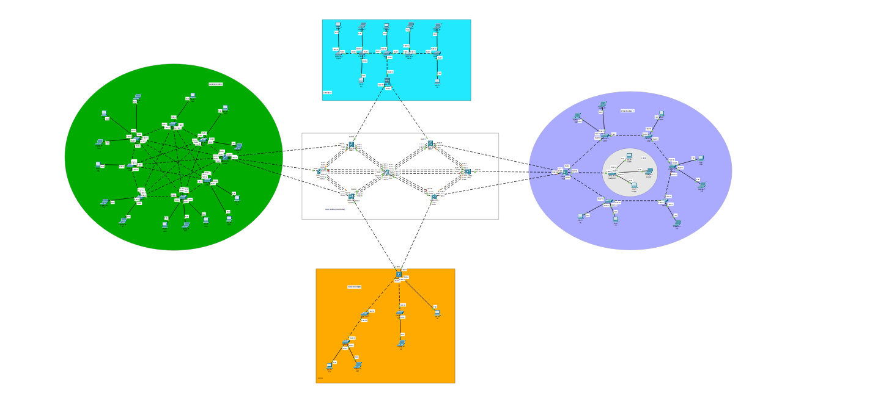
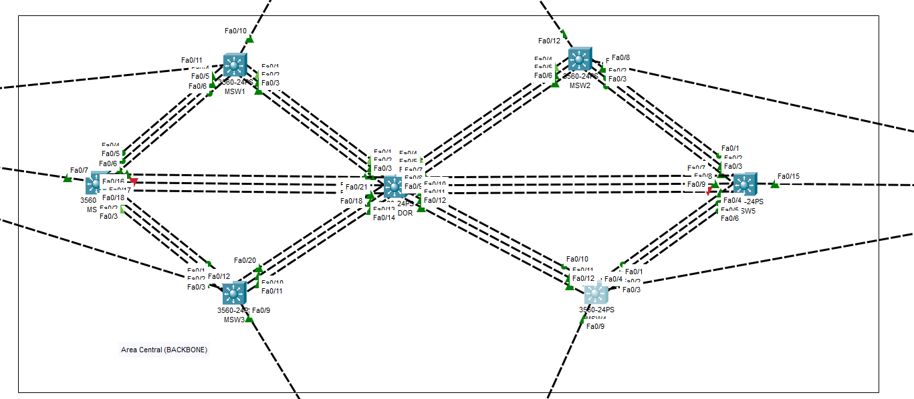
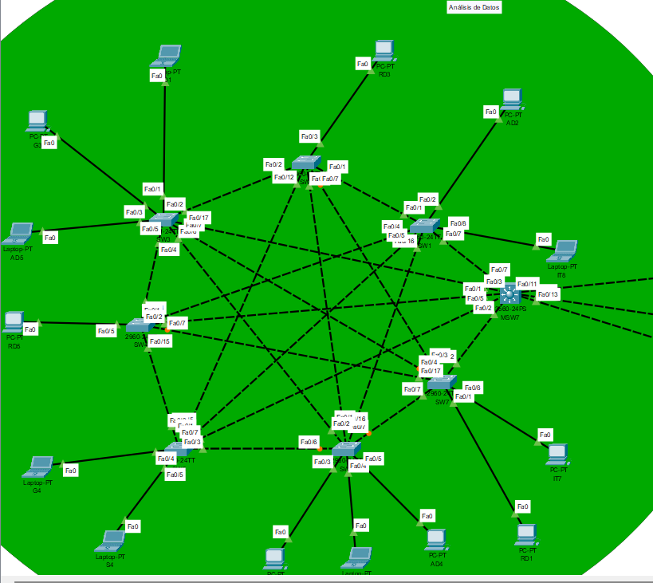
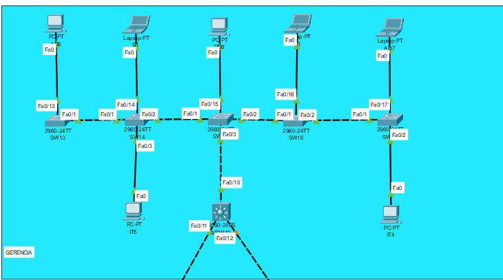
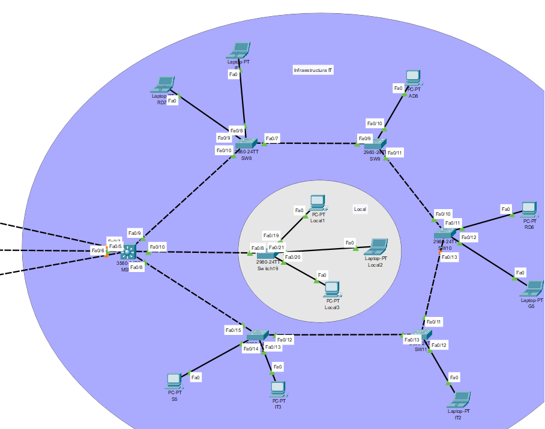
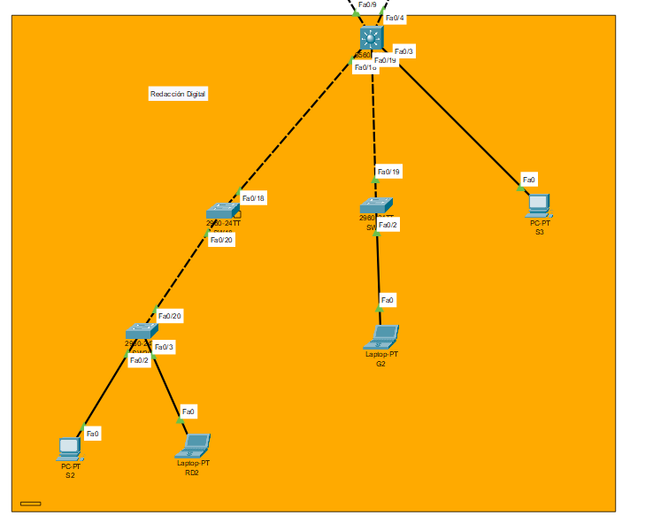

# Manual Técnico Proyecto #1

**Nombre:** Johan Moises Cardona Rosales 

**Carnet:**  202201405

**Universidad San Carlos de Guatemala**

**Curso:** Redes de Computadoras 1

---


## TOPOLOGÍAS

Topología



### AREA BACKCONE


### ANALISS DE DATOS


### GERENCIA


### INFRAESTRUCTURA IT


### REDACCION DIGITAL



---------
## Detalle de todas configuraciones de cada dispositivo

### PING DE TODOS LOS DISPOSITIVOS

## Redaccion Digital


| Departamento      | VLAN | IP              | Dispositivo | Nombre del dispositivo |
| ----------------- | ---- | --------------- | ----------- | ---------------------- |
| Redaccion digital | 15   | 192.168.15.1/24 | PC          | S2                     |
| Redaccion digital | 15   | 192.168.15.2/24 | LAPTOP      | RD2                    |
| Redaccion digital | 15   | 192.168.15.3/24 | PC          | G2                     |
| Redaccion digital | 15   | 192.168.15.4/24 | LAPTOP      | S3                     |

## Analisis de Datos


| Departamento      | VLAN | IP               | Dispositivo | Nombre del dispositivo |
| ----------------- | ---- | ---------------- | ----------- | ---------------------- |
| Analisis de Datos | 25   | 192.168.15.5/24  | LAPTOP      | IT8                    |
| Analisis de Datos | 25   | 192.168.15.6/24  | LAPTOP      | AD2                    |
| Analisis de Datos | 25   | 192.168.15.7/24  | PC          | RD3                    |
| Analisis de Datos | 25   | 192.168.15.8/24  | LAPTOP      | AD1                    |
| Analisis de Datos | 25   | 192.168.15.9/24  | PC          | G3                     |
| Analisis de Datos | 25   | 192.168.15.10/24 | LAPTOP      | AD5                    |
| Analisis de Datos | 25   | 192.168.15.11/24 | PC          | RD5                    |
| Analisis de Datos | 25   | 192.168.15.12/24 | LAPTOP      | G4                     |
| Analisis de Datos | 25   | 192.168.15.13/24 | LAPTOP      | S4                     |
| Analisis de Datos | 25   | 192.168.15.14/24 | PC          | AD3                    |
| Analisis de Datos | 25   | 192.168.15.15/24 | LAPTOP      | RD4                    |
| Analisis de Datos | 25   | 192.168.15.16/24 | PC          | AD4                    |
| Analisis de Datos | 25   | 192.168.15.17/24 | PC          | RD1                    |
| Analisis de Datos | 25   | 192.168.15.18/24 | PC          | IT7                    |

## Infraestructura IT


| Departamento       | VLAN | IP               | Dispositivo | Nombre del dispositivo |
| ------------------ | ---- | ---------------- | ----------- | ---------------------- |
| Infraestructura IT | 35   | 192.168.15.19/24 | PC          | S5                     |
| Infraestructura IT | 35   | 192.168.15.20/24 | PC          | IT3                    |
| Infraestructura IT | 35   | 192.168.15.21/24 | LAPTOP      | IT2                    |
| Infraestructura IT | 35   | 192.168.15.22/24 | LAPTOP      | G5                     |
| Infraestructura IT | 35   | 192.168.15.23/24 | PC          | RD6                    |
| Infraestructura IT | 35   | 192.168.15.24/24 | PC          | AD8                    |
| Infraestructura IT | 35   | 192.168.15.25/24 | LAPTOP      | IT1                    |
| Infraestructura IT | 35   | 192.168.15.26/24 | LAPTOP      | RD7                    |

## Area Local de Infraestructura IT


| Departamento | VLAN | IP               | Dispositivo | Nombre del dispositivo |
| ------------ | ---- | ---------------- | ----------- | ---------------------- |
| Local        | 75   | 192.168.15.27/24 | PC          | Local1                 |
| Local        | 75   | 192.168.15.28/24 | LAPTOP      | Local2                 |
| Local        | 75   | 192.168.15.29/24 | PC          | Local3                 |

## Area de Gerencia


| Departamento     | VLAN | IP               | Dispositivo | Nombre del dispositivo |
| ---------------- | ---- | ---------------- | ----------- | ---------------------- |
| Area de Gerencia | 55   | 192.168.15.30/24 | PC          | AD6                    |
| Area de Gerencia | 55   | 192.168.15.31/24 | LAPTOP      | S1                     |
| Area de Gerencia | 55   | 192.168.15.32/24 | PC          | RD8                    |
| Area de Gerencia | 55   | 192.168.15.33/24 | LAPTOP      | G1                     |
| Area de Gerencia | 55   | 192.168.15.34/24 | LAPTOP      | AD7                    |
| Area de Gerencia | 55   | 192.168.15.35/24 | PC          | IT4                    |
| Area de Gerencia | 55   | 192.168.15.36/24 | PC          | IT5                    |


## CONFIGURACIÓN PARA VLAN EN EL SERVIDOR

## BACKCONE AREA CENTRAL
### SERVIDOR


```bash
enable 
config terminal
hostname SERVIDOR

vtp domain C4_FIUComm
vtp mode server
spanning-tree mode rapid-pvst

vlan 15
 name Redaccion_Digital
exit

vlan 25
 name Analisis_Datos
exit

vlan 35
 name Infraestructura_IT
exit

vlan 45
 name Seguridad
exit

vlan 55
 name Gerencia
exit

```


```bash
enable 
conf t
spanning-tree mode rapid-pvst
spanning-tree vlan 1,15,25,35,45,55 priority 4096
```

EtherChannel con MSW1 (Po1)

```bash
interface range fa0/1 - 3
 switchport mode trunk
 channel-group 1 mode active
 !
interface port-channel 1
 switchport mode trunk
```


EtherChannel con MSW2 (Po2)
```bash
interface range fa0/4 - 6
 switchport mode trunk
 channel-group 2 mode active
 !
interface port-channel 2
 switchport mode trunk
```

EtherChannel con MSW3 (Po3)
```bash
interface range fa0/13-14, 21
 switchport mode trunk
 channel-group 3 mode active
 !
interface port-channel 3
 switchport mode trunk
```

EtherChannel con MSW4 (Po4)
```bash
interface range fa0/10 - 12
 switchport mode trunk
 channel-group 4 mode active
 !
interface port-channel 4
 switchport mode trunk
```


EtherChannel con MSW5 (Po5)
```bash
interface range fa0/7 - 9
 switchport mode trunk
 channel-group 5 mode active
 !
interface port-channel 5
 switchport mode trunk
```

EtherChannel con MSW6 (Po6)
```bash
interface range fa0/16 - 18
 switchport mode trunk
 channel-group 6 mode active
 !
interface port-channel 6
 switchport mode trunk
```

### MSW1 (VTP Client, Po1)
```bash
hostname MSW1
vtp domain C4_FIUComm
vtp mode client
spanning-tree mode rapid-pvst

! EtherChannel con SERVIDOR
interface range fa0/1 - 3
 switchport mode trunk
 channel-group 1 mode active
!
interface port-channel 1
 switchport mode trunk
```

### MSW2 (VTP Client, Po2)
```bash
hostname MSW1
vtp domain C4_FIUComm
vtp mode client
spanning-tree mode rapid-pvst

! EtherChannel con SERVIDOR
interface range fa0/4 - 6
 switchport mode trunk
 channel-group 2 mode active
!
interface port-channel 2
 switchport mode trunk
```

### MSW3 (VTP Client, Po3)
```bash
hostname MSW1
vtp domain C4_FIUComm
vtp mode client
spanning-tree mode rapid-pvst

! EtherChannel con SERVIDOR
interface range fa0/13 - 14, 21
 switchport mode trunk
 channel-group 3 mode active
!
interface port-channel 3
 switchport mode trunk
```

### MSW4 (VTP Client, Po4)
```bash
hostname MSW1
vtp domain C4_FIUComm
vtp mode client
spanning-tree mode rapid-pvst

! EtherChannel con SERVIDOR
interface range fa0/10 - 12
 switchport mode trunk
 channel-group 4 mode active
!
interface port-channel 4
 switchport mode trunk
```

### MSW5 (VTP Client, Po5)
```bash
hostname MSW1
vtp domain C4_FIUComm
vtp mode client
spanning-tree mode rapid-pvst

! EtherChannel con SERVIDOR
interface range fa0/7 - 9
 switchport mode trunk
 channel-group 5 mode active
!
interface port-channel 5
 switchport mode trunk
```

### MSW6 (VTP Client, Po6)
```bash
hostname MSW1
vtp domain C4_FIUComm
vtp mode client
spanning-tree mode rapid-pvst

! EtherChannel con SERVIDOR
interface range fa0/16 - 18
 switchport mode trunk
 channel-group 6 mode active
 !
interface port-channel 6
 switchport mode trunk
```


### Conf. Areas

#### Redacción Digital (VLAN 15)

MSW9
```bash
hostname MSW9
vtp domain C4_FIUComm
vtp mode client

interface fa0/9
 switchport mode trunk   ! uplink a backbone
interface fa0/18
 switchport mode trunk   ! uplink SW18
interface fa0/19
 switchport mode trunk   ! uplink SW19

interface fa0/3
 switchport mode access
 switchport access vlan 45
 spanning-tree portfast
 spanning-tree bpduguard enable
```

SW18
```bash
hostname SW18
vtp domain C4_FIUComm
vtp mode client

interface fa0/18
 switchport mode trunk   ! uplink a SW18
interface fa0/20
 switchport mode access
 switchport access vlan 15
 spanning-tree portfast
 spanning-tree bpduguard enable
```


SW19
```bash
hostname SW19
vtp domain C4_FIUComm
vtp mode client

interface fa0/19
 switchport mode trunk   ! uplink a SW18
interface fa0/2
 switchport mode access
 switchport access vlan 15
 spanning-tree portfast
 spanning-tree bpduguard enable
```

SW20 (ACCESO)
```bash
hostname SW20
vtp domain C4_FIUComm
vtp mode client

interface fa0/20
 switchport mode trunk   ! uplink a SW18


 //Este es el dispositivo que va dirigida a la VLAN de seguridad
interface fa0/2
 switchport mode access
 switchport access vlan 45
 spanning-tree portfast
 spanning-tree bpduguard enable


 interface fa0/3
 switchport mode access
 switchport access vlan 15
 spanning-tree portfast
 spanning-tree bpduguard enable
```

#### Análisis de Datos (VLAN 25)

MSW7 (distribuidor)
```bash
hostname MSW7
vtp domain C4_FIUComm
vtp mode client
vtp password proyecto12025

! Uplinks al backbone
interface fa0/11
 switchport mode trunk
interface fa0/6
 switchport mode trunk
interface fa0/13
 switchport mode trunk

! Uplinks a accesos
interface fa0/7
 switchport mode trunk
interface fa0/3
 switchport mode trunk
interface fa0/1
 switchport mode trunk
interface fa0/5
 switchport mode trunk
interface fa0/2
 switchport mode trunk
```

SW1
```bash
hostname SW1
vtp domain C4_FIUComm
vtp mode client
vtp password proyecto12025
spanning-tree mode rapid-pvst

! Uplink a MSW7 y enlaces a otros accesos
interface range fa0/7 , fa0/4 , fa0/1 , fa0/16 , fa0/5
 switchport mode trunk
 no shutdown

interface fa0/2
 description PC AD2
 switchport mode access
 switchport access vlan 25
 spanning-tree portfast
 spanning-tree bpduguard enable


 interface fa0/8
 description Laptop IT8
 switchport mode access
 switchport access vlan 35
 spanning-tree portfast
 spanning-tree bpduguard enable
```


SW2
```bash
hostname SW2
vtp domain C4_FIUComm
vtp mode client
spanning-tree mode rapid-pvst

! Uplinks
interface range fa0/1 , fa0/2 , fa0/16 , fa0/12 , fa0/7
 switchport mode trunk
 no shutdown

interface fa0/3
 description PC RD3
 switchport mode access
 switchport access vlan 15
 spanning-tree portfast
 spanning-tree bpduguard enable

```


SW3
```bash
hostname SW3
vtp domain C4_FIUComm
vtp mode client
spanning-tree mode rapid-pvst

! Uplinks
interface range fa0/17 , fa0/4 , fa0/2 , fa0/6 , fa0/7
 switchport mode trunk
 no shutdown


interface fa0/1
 description LAPTOP AD1
 switchport mode access
 switchport access vlan 25
 spanning-tree portfast
 spanning-tree bpduguard enable


 interface fa0/3
 description PC G3
 switchport mode access
 switchport access vlan 55
 spanning-tree portfast
 spanning-tree bpduguard enable


 interface fa0/5
 description LAPTOP AD5
 switchport mode access
 switchport access vlan 25
 spanning-tree portfast
 spanning-tree bpduguard enable

```

SW4
```bash
hostname SW4
vtp domain C4_FIUComm
vtp mode client
spanning-tree mode rapid-pvst

! Uplinks
interface range fa0/1 , fa0/2 , fa0/4 , fa0/15 , fa0/17
 switchport mode trunk
 no shutdown


interface fa0/5
 description PC RD5
 switchport mode access
 switchport access vlan 15
 spanning-tree portfast
 spanning-tree bpduguard enable

```


SW5
```bash
hostname SW5
vtp domain C4_FIUComm
vtp mode client
spanning-tree mode rapid-pvst

! Uplinks
interface range fa0/1 , fa0/7 , fa0/15 , fa0/2 , fa0/3
 switchport mode trunk
 no shutdown


interface fa0/4
 description LAPTOP G4
 switchport mode access
 switchport access vlan 55
 spanning-tree portfast
 spanning-tree bpduguard enable

 interface fa0/5
 description LAPTOP S4
 switchport mode access
 switchport access vlan 45
 spanning-tree portfast
 spanning-tree bpduguard enable
```


SW6
```bash
hostname SW6
vtp domain C4_FIUComm
vtp mode client
spanning-tree mode rapid-pvst

! Uplinks
interface range fa0/1 , fa0/2 , fa0/16 , fa0/6 , fa0/7
 switchport mode trunk
 no shutdown

interface fa0/3
 description PC AD3
 switchport mode access
 switchport access vlan 25
 spanning-tree portfast
 spanning-tree bpduguard enable

 interface fa0/4
 description Laptop RD4
 switchport mode access
 switchport access vlan 15
 spanning-tree portfast
 spanning-tree bpduguard enable

 interface fa0/5
 description PC AD4
 switchport mode access
 switchport access vlan 25
 spanning-tree portfast
 spanning-tree bpduguard enable
```


SW7
```bash
hostname SW7
vtp domain C4_FIUComm
vtp mode client
spanning-tree mode rapid-pvst

! Uplinks
interface range fa0/2 , fa0/4 , fa0/17 , fa0/3 , fa0/7
 switchport mode trunk
 no shutdown

interface fa0/1
 description PC RD1
 switchport mode access
 switchport access vlan 15
 spanning-tree portfast
 spanning-tree bpduguard enable

interface fa0/8
 description PC IT7
 switchport mode access
 switchport access vlan 35
 spanning-tree portfast
 spanning-tree bpduguard enable


```


#### INFRAESTRUCTURA IT (VLAN 35)

MSW8
```bash
hostname MSW8
vtp domain C4_FIUComm
vtp mode client
spanning-tree mode rapid-pvst

interface fa0/5
 switchport mode trunk
 no shutdown
interface fa0/6
 switchport mode trunk
 no shutdown
interface fa0/7
 switchport mode trunk
 no shutdown

interface fa0/9      
 switchport mode trunk
 no shutdown
interface fa0/8     
 switchport mode trunk
 no shutdown
interface fa0/10   
 switchport mode trunk
 no shutdown
```


SW8
```bash
hostname SW8
vtp domain C4_FIUComm
vtp mode client
vtp password proyecto12025
spanning-tree mode rapid-pvst

! Trunks
interface fa0/10     ! ↔ MSW8 Fa0/9
 switchport mode trunk
 no shutdown
interface fa0/7      ! ↔ SW9 Fa0/9
 switchport mode trunk
 no shutdown

! Puertos a usuarios
interface fa0/8
 description Laptop RD7
 switchport mode access
 switchport access vlan 15
 spanning-tree portfast
 spanning-tree bpduguard enable

interface fa0/9
 description Laptop IT1
 switchport mode access
 switchport access vlan 35
 spanning-tree portfast
 spanning-tree bpduguard enable

```


SW9
```bash
hostname SW9
vtp domain C4_FIUComm
vtp mode client
spanning-tree mode rapid-pvst

! Trunks
interface fa0/9      
 switchport mode trunk
 no shutdown
interface fa0/11     
 switchport mode trunk
 no shutdown

! Puertos a usuarios
interface fa0/10
 description PC AD8
 switchport mode access
 switchport access vlan 25
 spanning-tree portfast
 spanning-tree bpduguard enable

```


SW10
```bash
hostname SW10
vtp domain C4_FIUComm
vtp mode client
spanning-tree mode rapid-pvst

! Trunks
interface fa0/10     
 switchport mode trunk
 no shutdown
interface fa0/13    
 switchport mode trunk
 no shutdown

! Puertos a usuarios
interface fa0/11
 description PC RD6
 switchport mode access
 switchport access vlan 15
 spanning-tree portfast
 spanning-tree bpduguard enable

interface fa0/12
 description Laptop G5
 switchport mode access
 switchport access vlan 55
 spanning-tree portfast
 spanning-tree bpduguard enable

```


SW11
```bash
hostname SW11
vtp domain C4_FIUComm
vtp mode client
spanning-tree mode rapid-pvst

! Trunks
interface fa0/11     
 switchport mode trunk
 no shutdown
interface fa0/13     
 switchport mode trunk
 no shutdown

! Puertos a usuarios
interface fa0/12
 description Laptop IT2
 switchport mode access
 switchport access vlan 35
 spanning-tree portfast
 spanning-tree bpduguard enable

```

SW12

```bash
hostname SW12
vtp domain C4_FIUComm
vtp mode client
spanning-tree mode rapid-pvst

! Trunks
interface fa0/12     
 switchport mode trunk
 no shutdown
interface fa0/15    
 switchport mode trunk
 no shutdown

! Puertos a usuarios
interface fa0/14
 description PC S5
 switchport mode access
 switchport access vlan 45
 spanning-tree portfast
 spanning-tree bpduguard enable

interface fa0/13
 description Laptop IT3
 switchport mode access
 switchport access vlan 35
 spanning-tree portfast
 spanning-tree bpduguard enable


Switch19
```
```bash
hostname Switch19
vtp mode transparent
banner motd #Bienvenido a Recepcion - FIUComm_202201405#

! Crear VLAN 75 local
vlan 75
 name Recepcion

! Uplink a MSW8
interface fa0/8
 switchport mode trunk
 no shutdown

! Puertos a usuarios Recepción
interface fa0/19
 description PC Local1
 switchport mode access
 switchport access vlan 75
 spanning-tree portfast
 spanning-tree bpduguard enable

interface fa0/20
 description Laptop Local2
 switchport mode access
 switchport access vlan 75
 spanning-tree portfast
 spanning-tree bpduguard enable

interface fa0/21
 description PC Local3
 switchport mode access
 switchport access vlan 75
 spanning-tree portfast
 spanning-tree bpduguard enable
```

#### GERENCIA (VLAN 55)

MSW10

```bash
hostname MSW10
vtp domain C4_FIUComm
vtp mode client

spanning-tree mode rapid-pvst
banner motd #Bienvenido a Gerencia - FIUComm_202201405#

! Uplinks al backbone
interface fa0/11
 switchport mode trunk
 no shutdown
interface fa0/12
 switchport mode trunk
 no shutdown

! Trunk hacia el acceso del área
interface fa0/10      
 switchport mode trunk
 no shutdown

```

SW15

```bash
hostname SW15
vtp domain C4_FIUComm
vtp mode client
spanning-tree mode rapid-pvst

! Trunks
interface fa0/3      
 switchport mode trunk
 no shutdown
interface fa0/1       
 switchport mode trunk
 no shutdown
interface fa0/2       
 switchport mode trunk
 no shutdown

! Usuario
interface fa0/15      
 description RD8 - VLAN15
 switchport mode access
 switchport access vlan 15
 spanning-tree portfast
 spanning-tree bpduguard enable


```

SW14

```bash
hostname SW14
vtp domain C4_FIUComm
vtp mode client
spanning-tree mode rapid-pvst

! Trunks
interface fa0/2       
 switchport mode trunk
 no shutdown
interface fa0/1       
 switchport mode trunk
 no shutdown

! Usuarios
interface fa0/14      
 description S1 - VLAN45
 switchport mode access
 switchport access vlan 45
 spanning-tree portfast
 spanning-tree bpduguard enable

interface fa0/3       
 description IT5 - VLAN35
 switchport mode access
 switchport access vlan 35
 spanning-tree portfast
 spanning-tree bpduguard enable

```

SW13

```bash
hostname SW13
vtp domain C4_FIUComm
vtp mode client
spanning-tree mode rapid-pvst

! Trunk
interface fa0/1       
 switchport mode trunk
 no shutdown

! Usuario
interface fa0/13     
 description AD6 - VLAN25
 switchport mode access
 switchport access vlan 25
 spanning-tree portfast
 spanning-tree bpduguard enable

```


SW16

```bash
hostname SW16
vtp domain C4_FIUComm
vtp mode client
spanning-tree mode rapid-pvst

! Trunks
interface fa0/1      
 switchport mode trunk
 no shutdown
interface fa0/2    
 switchport mode trunk
 no shutdown

! Usuario
interface fa0/16   
 description G1 - VLAN55
 switchport mode access
 switchport access vlan 55
 spanning-tree portfast
 spanning-tree bpduguard enable


```


SW17

```bash
hostname SW17
vtp domain C4_FIUComm
vtp mode client
spanning-tree mode rapid-pvst

! Trunk
interface fa0/1       
 switchport mode trunk
 no shutdown

! Usuarios
interface fa0/17    
 description AD7 - VLAN25
 switchport mode access
 switchport access vlan 25
 spanning-tree portfast
 spanning-tree bpduguard enable

interface fa0/2       
 description IT4 - VLAN35
 switchport mode access
 switchport access vlan 35
 spanning-tree portfast
 spanning-tree bpduguard enable
```

## Presupuesto:


# Inventario de Equipos

| Dispositivo                | Unidades |
|-----------------------------|----------|
| Computadoras de Escritorio | 19       |
| Laptops                    | 17       |
| Switch Cisco 2960-24TT     | 21       |
| Switch Cisco 3560-24PS     | 11       |
| Cables Straight-Through    | 50       |
| Cables Crossover           | 20       |
| Patch Panels               | 2        |
| Rack de comunicaciones     | 1        |
| UPS                        | 1        |


### Costo Aprox. de cada dispostivo


| Cantidad | Equipo / Componente        | Precio unitario (Q) | Subtotal (Q)   |
|----------|----------------------------|----------------------|----------------|
| 19       | Computadoras de Escritorio | Q4,680               | Q88,920        |
| 17       | Laptops                    | Q6,240               | Q106,080       |
| 21       | Switch Cisco 2960-24TT     | Q4,680               | Q98,280        |
| 11       | Switch Cisco 3560-24PS     | Q9,360               | Q102,960       |
| 50       | Cables Straight-Through    | Q39                  | Q1,950         |
| 20       | Cables Crossover           | Q47                  | Q940           |
| 2        | Patch Panels               | Q1,170               | Q2,340         |
| 1        | Rack de comunicaciones     | Q7,800               | Q7,800         |
| 1        | UPS                        | Q11,700              | Q11,700        |

---

### **Total estimado: Q420,970**

